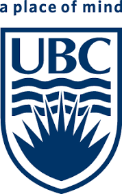
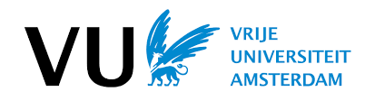
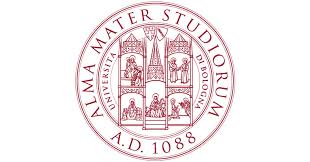

### 2017 - present

PhD in Bioinformatics - University of British Columbia, Vancouver, Canada              

#### 2013 - 2015

MSc in Bioinformatics - Vrije University, Amsterdam, The Netherlands      
 

#### 2010 - 2013

MSc in Molecular Biotechnology - University Alma Mater Studiorum, Bologna, Italy
 

#### 2007 - 2010

BSc in Biotechnology - University Alma Mater Studiorum, Bologna, Italy

