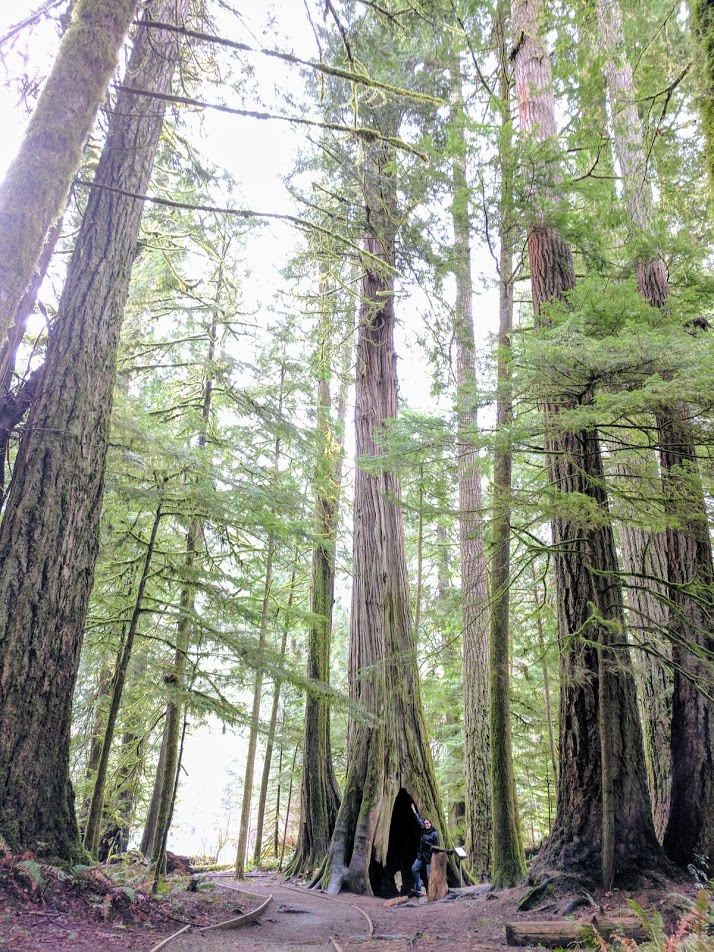

## About
My name is Kristina and I am a PhD student in Bioinfotmatics. 
Passionate about genomics and Computational Biology, I spent my MSc2 between wet and dry lab.

I am interested in entrepreneurship and interdisciplinary collaborations.   
My personal interests are philosophy, arts, music, video and photography.

For further details on my research projects, please visit my [Lab Page](http://www.birollab.ca/member/kgagalova).

*************

*The important thing is not to stop questioning. Curiosity has its own reason for existing. One cannot help but be in awe when he contemplates the mysteries of eternity, of life, of the marvelous structure of reality.*
*It is enough if one tries merely to comprehend a little of this mystery every day.*
*Never lose a holy curiosity.*           
**__Albert Einstein**

